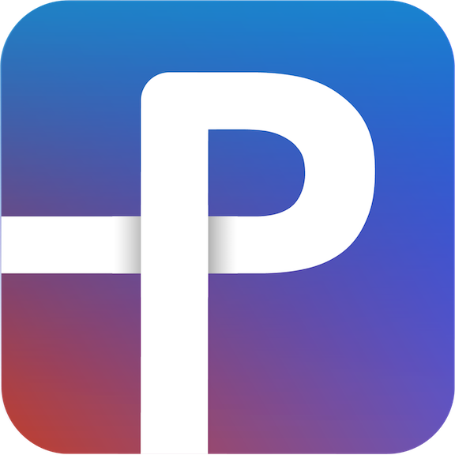

PennMobile iOS
===============

The official iOS app of the University of Pennsylvania.

Made with 💝 by Penn Labs.

## Features

* See hours, menus, and locations of campus dining halls
* Quickly book group study rooms on campus 
* Book select study rooms in a single tap
* See time remaining on your laundry and set notifications
* Avoid the busiest times of the day with laundry room traffic graphs
* See the hours and locations of Penn Fitness facilities
* Read Penn News from the DP, UTB, and 34th St. (mobile websites)
* Easily add campus phone numbers to your contacts
* Quickly access important Penn websites

## Contributing

Anyone can make a pull request and contribute! However, the most effective way to contribute is by applying for our dev team. Applications open in the fall and spring at [pennlabs.org](https://pennlabs.org)

NOTE: this repo requires [CocoaPods](http://cocoapods.org/) to work correctly. Please install both and always open the .xcworkspace file rather than the .xcodeproj file. If a simulator has trouble loading the app, remove the app from the simulator and try again.

## Penn Labs

Penn Labs is a team of student software engineers, product designers, and business developers.

Penn Labs empowers others to make connections: connections to resources, connections to people, and connections to the greater Penn community.

Our ultimate goal is improving the Penn community. We aim to do so not only by creating high-quality products, but also by giving back to the community with educational resources and technical support.